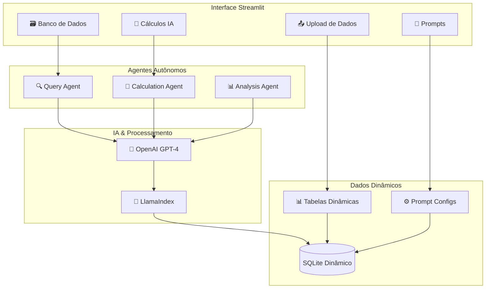

# 🤖 Sistema Inteligente de Análise de Dados com Agentes Autônomos


Sistema de análise e prcessamento de dados baseado em **Agentes de IA Autônomos** e **Tabelas Dinâmicas**. Processa qualquer tipo de dados, com prompts personalizados e  agentes que executam análises complexas automaticamente.

## 🌟 Funcionalidades

### 🧠 **Agentes de IA Autônomos**
- **🔍 Agente de Consulta**: Converte linguagem natural em SQL inteligente
- **🧮 Agente de Cálculo**: Executa cálculos complexos baseados em prompts configuráveis
- **💰 Tool Vale Refeição**: Cálculo especializado com regras de negócio brasileiras
- **📊 Agente de Análise**: Realiza análises multi-etapas com raciocínio transparente
- **🔄 Processo Iterativo**: Agentes executam múltiplas etapas até completar objetivos

### 📊 **Tabelas Dinâmicas Inteligentes**
- **🚀 Criação Automática**: Cada arquivo gera sua própria tabela no banco
- **🔗 Correlações Inteligentes**: Agentes identificam relações entre dados via prompts
- **🔑 Chaves Primárias Configuráveis**: Sistema sugere e permite configurar PKs
- **⚡ Performance Otimizada**: Estrutura adaptada aos dados reais

### 🎯 **Prompts Configuráveis**
- **📝 Linguagem Natural**: Defina regras e cálculos em português
- **🛠️ Ferramentas Selecionáveis**: Escolha capacidades específicas para cada agente
- **💾 Persistência**: Configurações salvas no banco para reutilização
- **🔄 Versionamento**: Histórico completo de configurações e execuções

### 🔍 **Sistema de Consultas Avançado**
- **🤖 Prompt to Query**: "Mostre funcionários com salário acima de R$ 5.000"
- **🧠 Consulta Autônoma**: Agente executa múltiplas etapas para responder perguntas complexas
- **📊 SQL Avançado**: Editor completo com validação e execução segura
- **📈 Resultados Dinâmicos**: Visualização sem recarregamento de página

## 🏗️ Nova Arquitetura



## 🚀 Quick Start

### ⚡ Instalação Rápida (SQLite)

1. **Clone e Configure**:
```bash
git clone https://github.com/seu-usuario/vale-refeicao-ia.git
cd vale-refeicao-ia
```

2. **Configuração Automática** (Windows):
```bash
# PowerShell
.\configurar_sqlite.ps1

# Ou Batch
configurar_sqlite.bat
```

3. **Instalação Manual**:
```bash
python -m venv venv
venv\Scripts\activate  # Windows
# ou
source venv/bin/activate  # Linux/Mac

pip install -r requirements.txt
```

4. **Configure OpenAI**:
```bash
# Crie .env com sua chave
echo "OPENAI_API_KEY=sk-sua-chave-aqui" > .env
echo "DATABASE_URL=sqlite:///./vale_refeicao.db" >> .env
```

5. **Execute**:
```bash
streamlit run app.py
```

## 📁 Estrutura Revolucionária

```
vale-refeicao-ia/
├── 🚀 app.py                          # App principal com layout inteligente
├── 📊 src/
│   ├── 🤖 agents/                     # Agentes autônomos
│   │   ├── extraction_agent.py        # Processamento de dados
│   │   ├── calculation_agent.py       # Cálculos via prompts
│   │   └── log_utils.py              # Logs em tempo real
│   ├── 💾 data/
│   │   ├── database.py               # Gerenciador dinâmico
│   │   └── models.py                 # Modelos simplificados
│   └── 🎨 ui/
│       ├── components.py             # Componentes reutilizáveis
│       └── pages/                    # Páginas da aplicação
│           ├── upload.py             # Upload unificado
│           ├── processing.py         # Processamento dinâmico
│           ├── database_viewer.py    # Visualizador avançado
│           ├── calculations.py       # Cálculos por IA
│           ├── prompts_manager.py    # Gerenciador de prompts
│           └── agent_monitor.py      # Monitor de agentes
├── ⚙️ configurar_sqlite.ps1          # Setup automático
└── 📚 docs/                          # Documentação
```

## 🎯 Como Usar o Novo Sistema

### 1. 📤 **Upload de Dados** (Simplificado)
```
📤 Upload de Dados
├── 📁 Selecione múltiplos arquivos
├── 🔄 Processamento automático
└── 📊 Cada arquivo = 1 tabela dinâmica
```

### 2. 🗃️ **Banco de Dados** (Inteligente)
```
🗃️ Visualizador de Banco de Dados
├── 📊 Tabelas de Dados (com indicadores de PK)
├── 🔗 Correlações (sugestões automáticas)
├── ⚙️ Tabelas do Sistema
└── 🔍 Buscas (Query)
    ├── 🤖 Prompt to Query
    ├── 🧠 Agente Autônomo
    └── 🔍 SQL Avançado
```

### 3. 🧮 **Cálculos** (Revolucionário)
```
🧮 Cálculos Inteligentes com IA
├── ⚙️ Configurar Cálculos
│   ├── 📝 Prompt em linguagem natural
│   ├── 🛠️ Seleção de ferramentas
│   └── 💾 Salvar configuração
├── 🚀 Executar Cálculos
│   ├── 🤖 Agente autônomo executa
│   ├── 🔄 Múltiplas iterações
│   └── 📊 Resultados detalhados
└── 📊 Histórico de Cálculos
```

### 4. 🎯 **Prompts** (Configurável)
```
🎯 Gerenciar Prompts
├── 📝 Editor de prompts
├── 🔧 Configurações de agentes
└── 📚 Biblioteca de prompts
```

## 💰 Tool Especializada: Cálculo de Vale Refeição

### 🎯 **Funcionalidades da Tool VR**
- **🏢 Regras Brasileiras**: Implementa legislação trabalhista do Brasil
- **🗺️ Valores por Estado**: São Paulo (R$ 37,50) vs Outros (R$ 35,00)
- **🚫 Exclusões Automáticas**: Férias, afastamentos, aprendizes, exterior, desligados
- **📊 Múltiplos Formatos**: Detalhado, estatísticas e formato padrão
- **💼 Divisão de Custos**: 80% empresa / 20% funcionário
- **⚡ Processamento**: Loop otimizado por colaborador

### 📋 **Estrutura de Dados Esperada**
```
📊 Tabelas Necessárias:
├── ativos.xlsx              # Lista de colaboradores ativos
│   ├── MATRICULA           # Chave primária
│   ├── NOME                # Nome do colaborador  
│   └── SINDICATO           # Sindicato (detecta SP automaticamente)
├── ferias.xlsx             # Colaboradores de férias
├── afastamentos.xlsx       # Colaboradores afastados
├── aprendiz.xlsx           # Aprendizes (excluídos)
├── exterior.xlsx           # Colaboradores no exterior
├── desligados.xlsx         # Colaboradores desligados
└── base_sindicato_x_valor.xlsx  # Valores por sindicato (opcional)
```

### 🧮 **Lógica de Cálculo**
```python
# 1. Carrega colaboradores ativos
ativos = carregar_tabela("ativos")

# 2. Identifica exclusões
exclusoes = {
    "ferias": carregar_matriculas("ferias"),
    "afastamentos": carregar_matriculas("afastamentos"),
    "aprendiz": carregar_matriculas("aprendiz"),
    "exterior": carregar_matriculas("exterior"),
    "desligados": carregar_matriculas("desligados")
}

# 3. Para cada colaborador ativo:
for colaborador in ativos:
    if colaborador.matricula not in exclusoes:
        # Determina valor por estado
        if "SP" in colaborador.sindicato:
            valor_diario = 37.50  # São Paulo
        else:
            valor_diario = 35.00  # Outros estados
        
        # Calcula valor mensal
        valor_total = valor_diario * 22  # 22 dias úteis
        
        # Divide custos
        custo_empresa = valor_total * 0.80      # 80%
        desconto_funcionario = valor_total * 0.20  # 20%
```

### 📊 **Saídas Geradas**
```
📄 Planilha Excel com 3 abas:

1. 📋 CALCULO_VALE_REFEICAO
   ├── MATRICULA, NOME, SINDICATO, ESTADO
   ├── STATUS (ELEGÍVEL/EXCLUÍDO)
   ├── MOTIVO_EXCLUSAO (se aplicável)
   └── DIAS_ELEGIVEL, VALOR_DIARIO, VALOR_TOTAL_VR

2. 📊 ESTATISTICAS_VR
   ├── Total de Colaboradores: 1.815
   ├── Elegíveis SP: 856 (R$ 37,50/dia)
   ├── Elegíveis Outros: 859 (R$ 35,00/dia)
   ├── Excluídos: 100
   ├── Valor Total Geral: R$ 1.342.385,00
   └── Percentuais e médias

3. 📄 FORMATO_PADRAO_VR
   ├── Admissão, Sindicato do Colaborador, Competência
   ├── Dias (22.00), VALOR DIÁRIO VR, TOTAL
   ├── Custo empresa (80%), Desconto profissional (20%)
   └── OBS GERAL (matrícula, nome, estado)
```

## 🤖 Exemplos de Uso dos Agentes

### 🔍 **Consulta com IA**
```
Pergunta: "Quantos funcionários ganham mais de R$ 5.000 por departamento?"

Agente:
1. 🔍 Analisa pergunta
2. 📊 Identifica tabelas necessárias
3. 🔍 Gera SQL: SELECT departamento, COUNT(*) FROM funcionarios WHERE salario > 5000 GROUP BY departamento
4. ⚡ Executa e apresenta resultados
```

### 🧮 **Cálculo Autônomo**
```
Prompt: "Atue como especialista de RH e calculista de vale refeições no Brasil.
A tabela ativos indica colaboradores e se relaciona com as demais pela MATRICULA.
Gere planilha com colaboradores ativos que tenham direito a vale refeição.
Não se paga para colaboradores de férias, aprendizes, afastados, no exterior ou desligados.
Considere um mês de 22 dias úteis."

Agente:
1. 📋 Planeja análise (9 etapas específicas)
2. 📊 Carrega colaboradores ativos (1.815 registros)
3. 🚫 Identifica exclusões (100 excluídos)
4. 💰 Aplica valores por estado (SP: R$ 37,50 | Outros: R$ 35,00)
5. 🧮 Calcula valores (22 dias × valor diário)
6. 📊 Gera 3 abas Excel: Cálculo + Estatísticas + Formato Padrão
7. ✅ Total: R$ 1.342.385,00 (1.715 elegíveis)
```

### 🧠 **Análise Complexa**
```
Pergunta: "Analise padrões salariais e identifique anomalias"

Agente:
1. 🔍 Explora estrutura dos dados
2. 📊 Calcula estatísticas descritivas
3. 🔍 Identifica outliers
4. 📈 Analisa distribuições
5. 💡 Gera insights e recomendações
```

## ⚙️ Configuração Avançada

### 🔑 **Variáveis de Ambiente**
```env
# IA
OPENAI_API_KEY=sk-sua-chave-openai
OPENAI_MODEL=gpt-4o

# Banco (SQLite padrão)
DATABASE_URL=sqlite:///./vale_refeicao.db

# Debug
DEBUG=false
```

### 🛠️ **Ferramentas dos Agentes**
```python
Ferramentas Disponíveis:
├── 🔍 Análise de Dados
│   ├── sql_query          # Consultas SQL
│   ├── data_exploration   # Análise exploratória
│   ├── data_correlation   # Correlações
│   └── data_quality       # Qualidade dos dados
├── 🧮 Cálculos
│   ├── calculo_vale_refeicao   # 💰 Cálculo especializado VR
│   ├── mathematical_operations  # Operações matemáticas
│   ├── conditional_logic       # Lógica condicional
│   ├── aggregations           # Agregações
│   └── report_generation      # Relatórios
└── 📊 Exportação
    ├── excel_export       # Planilhas Excel
    ├── csv_export         # Arquivos CSV
    └── json_export        # Dados JSON
```

## 📊 Monitoramento em Tempo Real

### 🔄 **Logs de Agentes**
- **📱 Coluna lateral**: Atividades em tempo real
- **🔍 Detalhamento**: Cada etapa do processo
- **⏱️ Timestamps**: Rastreamento temporal
- **🧹 Limpeza**: Histórico gerenciável

### 📈 **Métricas do Sistema**
- **📊 Tabelas**: Dinâmicas vs Sistema
- **🔑 Chaves Primárias**: Status e sugestões
- **⚙️ Configurações**: Prompts ativos
- **🤖 Agentes**: Execuções e performance

## 🔐 Segurança e Validação

### 🛡️ **SQL Seguro**
- **✅ Apenas SELECT**: Consultas somente leitura
- **🚫 Comandos Perigosos**: Bloqueio automático
- **🔍 Validação**: Sintaxe e segurança
- **📊 Sandbox**: Execução isolada

### 🔒 **Dados Protegidos**
- **💾 SQLite Local**: Dados não saem da máquina
- **🔐 Sem Exposição**: API keys protegidas
- **📝 Logs Auditáveis**: Rastreamento completo
- **🧹 Limpeza Automática**: Remoção de dados antigos

## 🚀 Casos de Uso

### 💼 **RH e Folha de Pagamento**
```
📊 Upload: ativos.xlsx, ferias.xlsx, afastamentos.xlsx, base_sindicato_x_valor.xlsx
🤖 Agente: "Calcule vale refeição seguindo regras brasileiras de RH"
📈 Resultado: 
   ├── 📋 Planilha detalhada (1.815 colaboradores)
   ├── 📊 Estatísticas por estado (SP vs Outros)
   ├── 📄 Formato padrão (80% empresa / 20% funcionário)
   └── 💰 Total: R$ 1.342.385,00
```

### 📈 **Análise Financeira**
```
📊 Upload: vendas.csv, custos.csv, metas.xlsx
🤖 Agente: "Analise performance vs metas por região"
📈 Resultado: Dashboard com recomendações
```

### 🏢 **Gestão Operacional**
```
📊 Upload: producao.xlsx, qualidade.csv, recursos.xlsx
🤖 Agente: "Identifique gargalos e oportunidades"
📈 Resultado: Análise detalhada com plano de ação
```

## 🔄 Roadmap

### 🎯 **Próximas Funcionalidades**
- [ ] 🔗 **Conectores**: APIs externas (ERP, CRM)
- [ ] 📊 **Dashboards**: Visualizações interativas
- [ ] 🤖 **Agentes Especializados**: Por domínio de negócio
- [ ] 🔄 **Automação**: Execução agendada
- [ ] 📱 **Mobile**: Interface responsiva
- [ ] 🌐 **Multi-tenant**: Múltiplas organizações

### 🧠 **IA Avançada**
- [ ] 🎯 **Prompt Engineering**: Templates inteligentes
- [ ] 📚 **Knowledge Base**: Aprendizado contínuo
- [ ] 🔍 **RAG**: Recuperação de contexto
- [ ] 🤖 **Multi-Agent**: Colaboração entre agentes

## 🤝 Contribuindo

### 🛠️ **Como Contribuir**
1. 🍴 Fork o projeto
2. 🌿 Crie sua branch (`git checkout -b feature/NovaFuncionalidade`)
3. 💾 Commit suas mudanças (`git commit -m 'Adiciona nova funcionalidade'`)
4. 📤 Push para a branch (`git push origin feature/NovaFuncionalidade`)
5. 🔄 Abra um Pull Request

### 📋 **Diretrizes**
- **🧪 Testes**: Inclua testes para novas funcionalidades
- **📚 Documentação**: Atualize README e docs
- **🎯 Prompts**: Teste com diferentes tipos de dados
- **🤖 Agentes**: Valide comportamento autônomo

## 📄 Licença

Este projeto está sob a licença MIT. Veja o arquivo [LICENSE](LICENSE) para mais detalhes.

## 🙏 Agradecimentos

- **🤖 OpenAI**: Pela API GPT-4 que alimenta nossos agentes
- **🦙 LlamaIndex**: Framework para agentes inteligentes
- **🎨 Streamlit**: Interface web intuitiva e poderosa
- **🐍 Python**: Linguagem que torna tudo possível
- **💾 SQLite**: Banco de dados simples e eficiente

---

## 🚀 **Comece Agora!**

```bash
git clone https://github.com/seu-usuario/vale-refeicao-ia.git
cd vale-refeicao-ia
.\configurar_sqlite.ps1  # Windows
streamlit run app.py
```

**Transforme seus dados em insights com o poder dos Agentes de IA Autônomos!** 🤖✨
