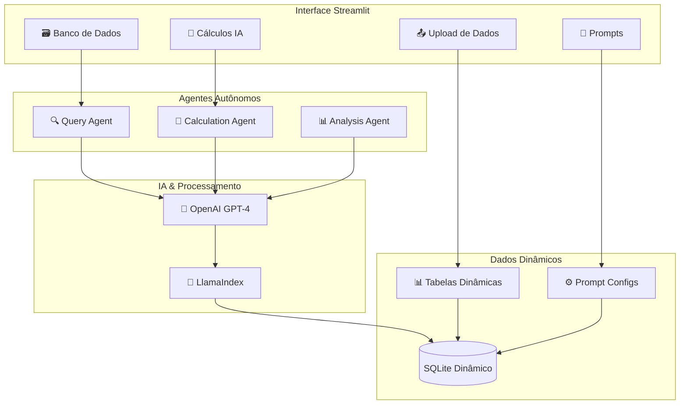
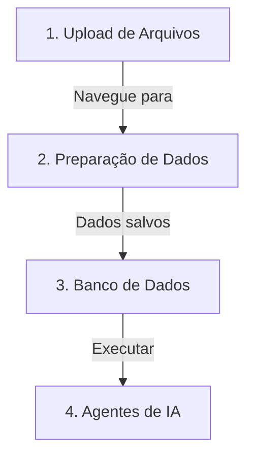
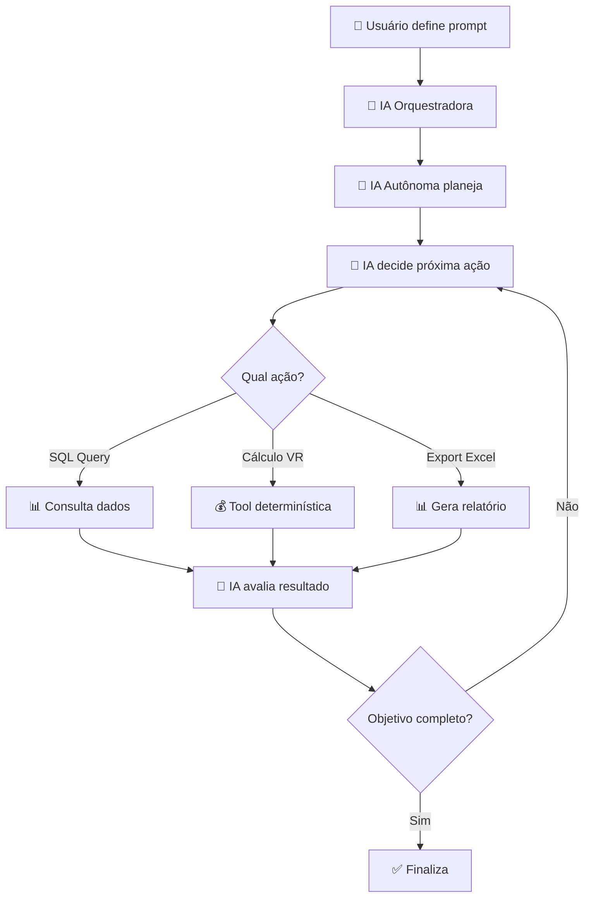

# 🤖 Sistema Inteligente de Análise de Dados com Agentes Autônomos

Sistema revolucionário de análise de dados baseado em **Agentes de IA Autônomos** e **Tabelas Dinâmicas**. Processe qualquer tipo de dados, configure prompts personalizados e deixe os agentes executarem análises complexas automaticamente.

## 🌟 Funcionalidades Revolucionárias

### 🧠 **Agentes de IA Autônomos**
- **🔍 Agente de Consulta**: Converte linguagem natural em SQL inteligente
- **🧮 Agente de Cálculo**: Executa cálculos complexos baseados em prompts configuráveis
- **📊 Agente de Análise Exploratória (EDA)**: Análise estatística completa de qualquer dataset
- **💰 Tool Vale Refeição**: Cálculo especializado com regras de negócio brasileiras
- **📈 Agente de Análise**: Realiza análises multi-etapas com raciocínio transparente
- **🔄 Processo Iterativo**: Agentes executam múltiplas etapas até completar objetivos

### 📊 **Tabelas Dinâmicas Inteligentes**
- **🚀 Criação Automática**: Cada arquivo gera sua própria tabela no banco
- **🔗 Correlações Inteligentes**: Agentes identificam relações entre dados via prompts
- **🔑 Chaves Primárias Configuráveis**: Seleção de índice personalizado no upload
- **🎯 Indexação Flexível**: Escolha qualquer coluna como chave primária
- **⚡ Performance Otimizada**: Estrutura adaptada aos dados reais

### 🎯 **Prompts Configuráveis**
- **📝 Linguagem Natural**: Defina regras e cálculos em português
- **🛠️ Ferramentas Selecionáveis**: Escolha capacidades específicas para cada agente
- **💾 Persistência**: Configurações salvas no banco para reutilização
- **🔄 Versionamento**: Histórico completo de configurações e execuções

### 🔍 **Sistema de Consultas Avançado**
- **🤖 Prompt to Query**: "Mostre funcionários com salário acima de R$ 5.000"
- **🧠 Consulta Autônoma**: Agente executa múltiplas etapas para responder perguntas complexas
- **📊 SQL Avançado**: Editor completo com validação e execução segura
- **📈 Resultados Dinâmicos**: Visualização sem recarregamento de página

### 💻 **Sistema de Geração de Código Python**

#### 📝 **Dois Tipos de Código nos Logs**

Quando você executa uma análise EDA, o sistema mostra dois códigos diferentes nos logs laterais:

1. **🎯 Código LLM Gerado (Real)**
   ```python
   # Código PURO do GPT-4
   # Exatamente como foi gerado
   media = creditcard['AMOUNT'].mean()
   mediana = creditcard['AMOUNT'].median()
   ```
   - **O que é**: Código original criado pelo LLM
   - **Quando aparece**: Logo após a geração
   - **Utilidade**: Debug e transparência

2. **💻 Código Final Executado**
   ```python
   # DataFrame disponível
   df = creditcard
   
   # Código do LLM aqui...
   media = creditcard['AMOUNT'].mean()
   
   # Garantir resultado
   if not execution_results:
       insights.append("Análise concluída")
   ```
   - **O que é**: Código processado e seguro
   - **Adições automáticas**: 
     - Acesso ao DataFrame
     - Inicializações necessárias
     - Garantia de resultado
   - **Utilidade**: Ver exatamente o que foi executado

#### 🔄 **Fluxo de Processamento**
```
1. Pergunta do usuário → LLM gera código específico
2. Validação de segurança (bloqueia exec, eval, etc.)
3. Adição de boilerplate necessário
4. Execução em ambiente sandbox seguro
5. Captura e exibição dos resultados
```

#### 🔍 **Recursos Inteligentes**
- **Correção de Digitação**: 'AMONT' automaticamente encontra 'AMOUNT'
- **Busca Fuzzy de Colunas**: Detecta nomes similares
- **Ambiente Isolado**: Execução segura com bibliotecas aprovadas
- **Logs Específicos**: Mostra apenas o código relevante

## 🏗️ Nova Arquitetura



## 🚀 Início Rápido - Passo a Passo

### ⚠️ **IMPORTANTE: Siga a ordem correta!**



### 📝 **Exemplo Prático Completo**

1. **Página Upload** → Carregue `vendas.csv`
2. **Página Preparação de Dados** → Clique "Processar"
3. **Página Banco de Dados** → Veja tabela criada
4. **Página Agentes de IA** → Configure análise desejada
5. **Veja resultados** → Estatísticas, outliers, correlações

## ⚠️ Importante: Reinicialização após Mudanças

### 🔄 **Quando Reiniciar o Streamlit**

Sempre que você fizer alterações em:
- 📝 Arquivos Python (.py)
- ⚙️ Arquivo de configuração (.env)
- 📦 Instalação de novas bibliotecas
- 🔧 Arquivo config.toml

### 🛑 **Como Reiniciar**

```bash
# 1. Pare o servidor atual (no terminal onde está rodando)
Ctrl + C

# 2. Inicie novamente
streamlit run app.py
```

### 💡 **Dica: Desenvolvimento Rápido**

Para desenvolvimento, use o modo de auto-reload:
```bash
# O Streamlit detecta mudanças automaticamente
streamlit run app.py --server.runOnSave true
```

### 🚨 **Mudanças que SEMPRE precisam reiniciar**:
- Alteração no limite de upload (config.toml)
- Mudança na chave da API (arquivo .env)
- Instalação de novas dependências (pip install)
- Alterações em imports ou estrutura de arquivos

## 🌐 Deploy em Produção (Google Cloud Run)

### ☁️ **Sistema Rodando na Nuvem**

A aplicação está otimizada para rodar no **Google Cloud Run** com suporte completo a:

- **📦 Build Automático**: Docker otimizado para Linux/Cloud
- **☁️ Cloud Storage**: Upload de arquivos até 500MB
- **🔐 Autenticação Automática**: Service Account gerenciada
- **⚡ Escalabilidade**: Auto-scaling baseado em demanda
- **🌍 Acesso Global**: URL pública HTTPS

### 🚀 **Como Fazer Deploy**

#### **Pré-requisitos:**
```bash
# 1. Instalar Google Cloud SDK
# Download: https://cloud.google.com/sdk/docs/install

# 2. Fazer login
gcloud auth login
gcloud config set project SEU_PROJECT_ID
```

#### **Deploy Rápido:**
```bash
cd vale-refeicao-ia

# Deploy automático (Cloud Run faz build e deploy)
gcloud run deploy crmia-agente-autonomo \
  --source . \
  --platform managed \
  --region southamerica-east1 \
  --allow-unauthenticated \
  --memory 2Gi \
  --cpu 2 \
  --timeout 600 \
  --set-env-vars OPENAI_API_KEY=sk-sua-chave-aqui
```

#### **Configurar Cloud Storage (para uploads grandes):**
```bash
# 1. Criar bucket
gcloud storage buckets create gs://seu-bucket-uploads \
  --location=southamerica-east1

# 2. Configurar variáveis no Cloud Run
gcloud run services update crmia-agente-autonomo \
  --region=southamerica-east1 \
  --set-env-vars \
    GCS_BUCKET_NAME=seu-bucket-uploads,\
    GCP_PROJECT_ID=seu-project-id
```

### 📊 **Recursos do Cloud Storage**

```python
Storage Inteligente:
├── ☁️ Produção (Cloud Run)
│   ├── Upload direto para Google Cloud Storage
│   ├── Limite: 500MB por arquivo
│   ├── Persistência: Dados mantidos entre deploys
│   └── Performance: Alta disponibilidade
└── 💾 Desenvolvimento (Local)
    ├── Salvamento em disco local
    ├── Limite: 200MB por arquivo
    └── Ideal para testes
```

### 🔧 **Variáveis de Ambiente Necessárias**

```env
# Obrigatórias
OPENAI_API_KEY=sk-sua-chave-openai

# Opcionais (Cloud Storage)
GCS_BUCKET_NAME=seu-bucket-uploads
GCP_PROJECT_ID=seu-project-id

# Configurações
OPENAI_MODEL=gpt-4-turbo-preview
DATABASE_URL=sqlite:///./vale_refeicao.db
```

### 📚 **Documentação Completa de Deploy**

- **`DEPLOY_RAPIDO.md`** - Comandos prontos para deploy
- **`PROBLEMA_BUILD_RESOLVIDO.md`** - Soluções de problemas comuns
- **`INSTRUCOES_FINAIS.md`** - Guia completo passo a passo

---

## 🚀 Quick Start (Desenvolvimento Local)

### ⚡ Instalação Rápida (SQLite)

1. **Clone e Configure**:
```bash
git clone https://github.com/seu-usuario/vale-refeicao-ia.git
cd vale-refeicao-ia
```

2. **Configuração Automática** (Windows):
```bash
# PowerShell
.\configurar_sqlite.ps1

# Ou Batch
configurar_sqlite.bat
```

3. **Instalação Manual**:
```bash
python -m venv venv
venv\Scripts\activate  # Windows
# ou
source venv/bin/activate  # Linux/Mac

pip install -r requirements.txt
```

4. **Configure OpenAI**:
```bash
# Crie .env com sua chave
echo "OPENAI_API_KEY=sk-sua-chave-aqui" > .env
echo "DATABASE_URL=sqlite:///./vale_refeicao.db" >> .env
```

5. **Execute**:
```bash
streamlit run app.py
```

> **📌 Lembrete**: Após qualquer mudança no código, reinicie com `Ctrl+C` e `streamlit run app.py`

## 📁 Estrutura 

```
vale-refeicao-ia/
├── 🚀 app.py                          # App principal com layout inteligente
├── 📊 src/
│   ├── 🤖 agents/                     # Agentes autônomos
│   │   ├── extraction_agent.py        # Processamento de dados
│   │   ├── calculation_agent.py       # Cálculos via prompts
│   │   └── log_utils.py              # Logs em tempo real
│   ├── 💾 data/
│   │   ├── database.py               # Gerenciador dinâmico
│   │   └── models.py                 # Modelos simplificados
│   ├── 🛠️ utils/
│   │   ├── cloud_storage.py          # ☁️ Gerenciador Cloud Storage
│   │   ├── excel_generator.py        # Geração de Excel
│   │   ├── eda_tool.py               # Análise exploratória
│   │   └── python_executor.py        # Executor de código
│   └── 🎨 ui/
│       ├── components.py             # Componentes reutilizáveis
│       └── pages/                    # Páginas da aplicação
│           ├── upload.py             # Upload com Cloud Storage
│           ├── processing.py         # Processamento dinâmico
│           ├── database_viewer.py    # Visualizador avançado
│           ├── calculations.py       # Cálculos por IA
│           ├── prompts_manager.py    # Gerenciador de prompts
│           └── agent_monitor.py      # Monitor de agentes
├── 🐳 Dockerfile                      # Container otimizado
├── 🐳 .dockerignore                   # Otimização de build
├── ☁️ cloudbuild.yaml                 # Config Cloud Build
├── ⚙️ .streamlit/config.toml          # Config Streamlit (500MB upload)
├── ⚙️ configurar_sqlite.ps1          # Setup automático
└── 📚 docs/                          # Documentação completa
    ├── DEPLOY_RAPIDO.md              # Deploy Cloud Run
    ├── INSTRUCOES_FINAIS.md          # Guia completo
    └── PROBLEMA_BUILD_RESOLVIDO.md   # Troubleshooting
```

## 🎯 Como Usar o Novo Sistema

### 📋 **Fluxo Completo do Sistema**


### 1. 📤 **Upload de Dados** (Passo 1)
```
📤 Upload de Dados
├── 📁 Selecione múltiplos arquivos (CSV, Excel)
├── 🔑 Defina coluna de indexação personalizada
├── ✅ Arquivos carregados automaticamente
├── 📊 Preview dos dados
├── ⚡ Suporte a arquivos:
│   ├── ☁️ Cloud Storage (Cloud Run): até 500MB
│   └── 💾 Local (desenvolvimento): até 200MB
├── 🔄 Storage inteligente:
│   ├── ☁️ Produção → Google Cloud Storage
│   └── 💾 Local → Disco local
└── ➡️ IMPORTANTE: Vá para "Preparação de Dados" após upload
```

### 2. 🔄 **Preparação de Dados** (Passo 2 - OBRIGATÓRIO)
```
🔄 Preparação e Armazenamento
├── 🤖 Agente de extração limpa e valida dados
├── 🏗️ Cria tabelas dinâmicas no banco SQLite
├── 📊 Detecta tipos de dados automaticamente
├── 🔑 Aplica chaves primárias definidas
├── 📈 Mostra logs em tempo real
└── ✅ Salva dados no banco permanentemente
```

### 3. 🗃️ **Banco de Dados** (Passo 3)
```
🗃️ Visualizador de Banco de Dados
├── 📊 Tabelas de Dados (com indicadores de PK)
├── 🔗 Correlações (sugestões automáticas)
├── ⚙️ Tabelas do Sistema
└── 🔍 Buscas (Query)
    ├── 🤖 Prompt to Query
    ├── 🧠 Agente Autônomo
    └── 🔍 SQL Avançado
```

### 4. 🤖 **Agentes de IA** (Passo 4)
```
🤖 Agentes Autônomos Inteligentes
├── ⚙️ Configurar Agentes
│   ├── 📝 Prompt em linguagem natural
│   ├── 🛠️ Seleção de ferramentas
│   └── 💾 Salvar configuração
├── 🚀 Executar Análises
│   ├── 📊 Análise Exploratória (EDA)
│   ├── 🧮 Cálculos Complexos
│   ├── 💰 Vale Refeição
│   └── 🔄 Múltiplas iterações
└── 📊 Histórico de Execuções
```

### 5. 🎯 **Prompts** (Configuração Avançada)
```
🎯 Gerenciar Prompts
├── 📝 Editor de prompts
├── 🔧 Configurações de agentes
└── 📚 Biblioteca de prompts
```

## 📊 Nova Funcionalidade: Análise Exploratória de Dados (EDA)

### 🎯 **O que é a Análise EDA**
Ferramenta completa para explorar e entender qualquer dataset, não limitada apenas a vale refeição. Realiza análises estatísticas profundas e identifica padrões automaticamente.

### 📈 **Análises Disponíveis**
- **📊 Estatísticas Descritivas**: média, mediana, desvio padrão, quartis
- **🔍 Análise de Tipos**: numéricos, categóricos, temporais
- **❓ Valores Ausentes**: identificação e padrões de ausência
- **📉 Distribuições**: normalidade, assimetria, curtose
- **🔗 Correlações**: matriz completa e pares fortemente correlacionados
- **🎯 Detecção de Outliers**: método IQR com limites automáticos
- **📊 Visualizações**: histogramas, boxplots, heatmaps
- **💡 Insights Automáticos**: recomendações baseadas nos dados

### 🚀 **Como Usar a Análise EDA**

#### 1. **No Upload de Arquivos**
```python
1. Faça upload de qualquer CSV/Excel
2. Marque "Definir coluna de indexação"
3. Escolha a coluna desejada como chave primária
4. O sistema se adapta a qualquer estrutura de dados
```

#### 2. **Via Agente Autônomo**
```
Exemplos de perguntas:
- "Faça uma análise exploratória completa dos dados"
- "Quais são as estatísticas e distribuições das variáveis?"
- "Identifique correlações e outliers nas tabelas"
- "Mostre padrões e tendências nos dados"
```

#### 3. **Perguntas Específicas Suportadas**
```
📊 Descrição dos Dados:
- "Quais são os tipos de dados (numéricos, categóricos)?"
- "Qual a distribuição de cada variável?"
- "Quais as medidas de tendência central?"

🔍 Identificação de Padrões:
- "Existem padrões temporais?"
- "Quais valores são mais frequentes?"
- "Existem agrupamentos nos dados?"

🎯 Detecção de Anomalias:
- "Existem valores atípicos?"
- "Como os outliers afetam a análise?"

🔗 Relações entre Variáveis:
- "Como as variáveis estão relacionadas?"
- "Existe correlação entre as variáveis?"
```

### 📊 **Exemplo de Resultado EDA**
```
✅ Análise Completa da Tabela 'vendas.csv':

📈 Estatísticas Básicas:
- 10.000 registros, 15 colunas
- 3 colunas numéricas, 8 categóricas, 4 temporais
- 2% valores ausentes em 'desconto'

🔗 Correlações Fortes Encontradas:
- preço ↔️ quantidade: -0.85 (correlação negativa forte)
- vendas ↔️ lucro: 0.92 (correlação positiva forte)

🎯 Outliers Detectados:
- preço: 45 outliers (0.45%)
- quantidade: 120 outliers (1.2%)

💡 Insights:
- Distribuição de vendas é assimétrica à direita
- Sazonalidade detectada em vendas mensais
- 5 categorias representam 80% das vendas

🎯 Recomendações:
- Investigar os 45 outliers de preço
- Considerar transformação log para vendas
- Remover 200 linhas duplicadas (2%)
```

## 💰 Tool Especializada: Cálculo de Vale Refeição

### 🎯 **Funcionalidades da Tool VR**
- **🏢 Regras Brasileiras**: Implementa legislação trabalhista do Brasil
- **🗺️ Valores por Estado**: São Paulo (R$ 37,50) vs Outros (R$ 35,00)
- **🚫 Exclusões Automáticas**: Férias, afastamentos, aprendizes, exterior, desligados
- **📊 Múltiplos Formatos**: Detalhado, estatísticas e formato padrão
- **💼 Divisão de Custos**: 80% empresa / 20% funcionário
- **⚡ Processamento**: Loop otimizado por colaborador

### 📋 **Estrutura de Dados Esperada**
```
📊 Tabelas Necessárias:
├── ativos.xlsx              # Lista de colaboradores ativos
│   ├── MATRICULA           # Chave primária
│   ├── NOME                # Nome do colaborador  
│   └── SINDICATO           # Sindicato (detecta SP automaticamente)
├── admissao_abril.xlsx     # Funcionários contratados em abril (NOVO!)
│   ├── MATRICULA           # Chave primária (validação anti-duplicata)
│   ├── NOME                # Nome do contratado
│   └── SINDICATO           # Sindicato para cálculo de valor
├── ferias.xlsx             # Colaboradores de férias
├── afastamentos.xlsx       # Colaboradores afastados
├── aprendiz.xlsx           # Aprendizes (excluídos)
├── exterior.xlsx           # Colaboradores no exterior
├── desligados.xlsx         # Colaboradores desligados
└── base_sindicato_x_valor.xlsx  # Valores por sindicato (opcional)
```

### 🧮 **Lógica de Cálculo Atualizada**
```python
# 1. Carrega colaboradores ativos
ativos = carregar_tabela("ativos")

# 1.1. Adiciona funcionários contratados (se existir tabela)
if tabela_existe("admissao_abril"):
    contratados_abril = carregar_tabela("admissao_abril")
    # Filtra apenas os que NÃO estão em ativos (evita duplicação)
    novos_contratados = contratados_abril[~contratados_abril.MATRICULA.isin(ativos.MATRICULA)]
    # Combina as listas
    ativos = combinar(ativos, novos_contratados)

# 2. Identifica exclusões
exclusoes = {
    "ferias": carregar_matriculas("ferias"),
    "afastamentos": carregar_matriculas("afastamentos"),
    "aprendiz": carregar_matriculas("aprendiz"),
    "exterior": carregar_matriculas("exterior"),
    "desligados": carregar_matriculas("desligados")
}

# 3. Para cada colaborador ativo:
for colaborador in ativos:
    if colaborador.matricula not in exclusoes:
        # Determina valor por estado
        if "SP" in colaborador.sindicato:
            valor_diario = 37.50  # São Paulo
        else:
            valor_diario = 35.00  # Outros estados
        
        # Calcula valor mensal
        valor_total = valor_diario * 22  # 22 dias úteis
        
        # Divide custos
        custo_empresa = valor_total * 0.80      # 80%
        desconto_funcionario = valor_total * 0.20  # 20%
```

### 📊 **Saídas Geradas**
```
📄 Planilha Excel com 3 abas:

1. 📋 CALCULO_VALE_REFEICAO
   ├── MATRICULA, NOME, SINDICATO, ESTADO
   ├── STATUS (ELEGÍVEL/EXCLUÍDO)
   ├── MOTIVO_EXCLUSAO (se aplicável)
   └── DIAS_ELEGIVEL, VALOR_DIARIO, VALOR_TOTAL_VR

2. 📊 ESTATISTICAS_VR
   ├── Total de Colaboradores: 1.815
   ├── Elegíveis SP: 856 (R$ 37,50/dia)
   ├── Elegíveis Outros: 859 (R$ 35,00/dia)
   ├── Excluídos: 100
   ├── Valor Total Geral: R$ 1.342.385,00
   └── Percentuais e médias

3. 📄 FORMATO_PADRAO_VR
   ├── Admissão, Sindicato do Colaborador, Competência
   ├── Dias (22.00), VALOR DIÁRIO VR, TOTAL
   ├── Custo empresa (80%), Desconto profissional (20%)
   └── OBS GERAL (matrícula, nome, estado)
```

## 💰 Ferramenta "Cálculo de Vale Refeição" - Análise Detalhada

### 🎯 **Objetivo Principal**
A ferramenta "Cálculo de Vale Refeição" é um **agente especializado** que automatiza completamente o processo de cálculo de benefícios alimentação seguindo as **regras brasileiras de RH**, eliminando trabalho manual e garantindo precisão total.

### 🔧 **Funcionalidades Principais**

#### 1. **🔍 Análise Automática de Elegibilidade**
- **Carrega colaboradores ativos** da tabela principal
- **➕ Inclui funcionários contratados** da tabela `admissao_abril` que não estejam em `ativos`
- **🚫 Evita duplicações** através de validação cruzada por MATRÍCULA
- **Identifica exclusões automáticas** através de múltiplas tabelas:
  - ❌ Colaboradores de férias
  - ❌ Afastamentos médicos/licenças
  - ❌ Aprendizes (não elegíveis)
  - ❌ Funcionários no exterior
  - ❌ Desligados do quadro
- **Aplica regras de negócio** específicas do RH brasileiro

#### 2. **💰 Cálculo Inteligente por Estado**
- **São Paulo**: R$ 37,50/dia (detecção automática via campo SINDICATO)
- **Outros Estados**: R$ 35,00/dia
- **Valores customizáveis** via tabela `base_sindicato_x_valor.xlsx`
- **22 dias úteis padrão** (configurável)

#### 3. **📊 Geração de Relatórios Completos**
A ferramenta gera **automaticamente** 3 abas Excel:

**📋 Aba "CALCULO_VALE_REFEICAO":**
- Lista completa com todos os colaboradores
- Status de elegibilidade individual
- Motivos de exclusão detalhados
- Valores calculados por pessoa

**📊 Aba "ESTATISTICAS_VR":**
- Totalizadores gerais e por estado
- Percentuais de elegibilidade
- Médias e análises estatísticas
- Resumo executivo para gestão

**📄 Aba "FORMATO_PADRAO_VR":**
- Layout padrão para folha de pagamento
- Divisão de custos (80% empresa / 20% funcionário)
- Campos prontos para importação em sistemas

#### 4. **🧠 Inteligência Artificial Integrada**
- **Detecção automática** de padrões nos dados
- **Sugestões inteligentes** para correções
- **Validação cruzada** entre tabelas
- **Logs detalhados** de todo o processo

#### 5. **⚡ Performance e Escalabilidade**
- Processa **milhares de registros** em segundos
- **Otimizações SQL** para grandes volumes
- **Cache inteligente** para execuções repetidas
- **Exportação automática** sem intervenção manual

### 🎮 **Como Usar**

1. **📤 Upload dos Arquivos**:
   - `ativos.xlsx` - Lista de colaboradores principais
   - `admissao_abril.xlsx` - Funcionários contratados em abril (opcional)
   - `ferias.xlsx`, `afastamentos.xlsx`, etc. - Exclusões

2. **🔄 Processamento Inteligente**:
   - Sistema carrega colaboradores ativos
   - **Adiciona automaticamente** funcionários de `admissao_abril` que não estejam em `ativos`
   - **Valida e remove duplicatas** por MATRÍCULA
   - Logs detalhados de todo o processo

3. **🚀 Execução Automática**:
   - Selecione a configuração "Vale Refeição Padrão"
   - Clique em "Iniciar Cálculo Autônomo"
   - Aguarde o processamento (30-60 segundos)

4. **📊 Resultados**:
   - Excel completo gerado automaticamente
   - Disponível na aba "Exportações"
   - Logs detalhados do processo com contadores por origem

### 💡 **Vantagens Competitivas**

- **🕐 Economia de Tempo**: Processo que levava horas agora leva minutos
- **🎯 Precisão Total**: Elimina erros humanos de cálculo
- **📋 Conformidade**: Segue rigorosamente a legislação brasileira
- **🔄 Reutilizável**: Configurações salvas para uso mensal
- **📊 Transparência**: Logs completos de todas as decisões
- **🔧 Customizável**: Regras adaptáveis para diferentes empresas

## 🧠 Uso de Agentes de IA na Aplicação

### 🎯 **Onde a IA é Utilizada**

A aplicação utiliza **Inteligência Artificial (OpenAI GPT)** em **duas camadas principais**:

#### **1. 🧮 Agente de Cálculo Autônomo (Orquestração IA)**
**Localização:** `src/ui/pages/calculations.py` → `execute_autonomous_calculation()`

```python
# O usuário define um prompt em linguagem natural:
calculation_prompt = f"""
CONTEXTO: Você é um agente especializado em cálculos de benefícios e análises de RH.

OBJETIVO: {config['prompt']}  # Ex: "Calcule vale refeição para todos os funcionários ativos"

FERRAMENTAS DISPONÍVEIS: {', '.join(config['available_tools'])}

INSTRUÇÕES:
1. Analise os dados disponíveis nas tabelas
2. Aplique as regras de cálculo especificadas
3. Gere resultados detalhados e organizados
4. Forneça relatórios com totais e estatísticas

Execute o cálculo de forma autônoma.
"""
```

**🤖 Como a IA funciona aqui:**
- **Recebe prompt** em linguagem natural do usuário
- **Analisa tabelas** disponíveis no banco de dados
- **Cria um plano** de execução estruturado
- **Executa iterações** até completar o objetivo
- **Decide quais ferramentas** usar em cada etapa
- **Chama a tool específica** (ex: `calculo_vale_refeicao_tool`)

#### **2. 🔄 Agente Autônomo Multi-Iterativo (Decisão IA)**
**Localização:** `src/ui/pages/database_viewer.py` → `execute_autonomous_agent()`

```python
# IA configurada com OpenAI GPT
llm = OpenAI(
    api_key=settings.openai_api_key,
    model=settings.openai_model,  # Ex: gpt-4
    temperature=0.3,
    request_timeout=60.0,
    max_retries=3
)

# IA decide a próxima ação baseada no contexto
action_prompt = f"""
OBJETIVO: {objective}
TABELAS: {tables_available}
PASSO ATUAL: {current_step}

Responda APENAS JSON:
{{
"action_type": "sql_query" | "calculo_vale_refeicao" | "excel_export",
"target_table": "nome_da_tabela",
"description": "o que está fazendo",
"analysis_complete": true/false
}}
"""

# IA responde e sistema executa a ação
response = llm.complete(action_prompt)
action_plan = json.loads(response.text)
```

**🤖 Como a IA funciona aqui:**
- **Planeja estratégia** baseada no objetivo
- **Decide próxima ação** em cada iteração
- **Escolhe tabelas relevantes** para consultar
- **Determina quando usar** ferramentas específicas
- **Adapta-se aos resultados** de etapas anteriores
- **Finaliza quando** objetivo é atingido

#### **3. 💰 Tool de Cálculo Vale Refeição (Lógica Determinística)**
**Localização:** `src/ui/pages/database_viewer.py` → `calculo_vale_refeicao_tool()`

⚠️ **IMPORTANTE:** Esta tool **NÃO usa IA diretamente**. Ela implementa **lógica de negócio determinística**:

```python
def calculo_vale_refeicao_tool(db, data_tables: list) -> dict:
    """
    Tool especializada para cálculo de vale refeição
    Implementa a lógica de negócio específica do RH brasileiro
    """
    # 1. Carrega dados (SEM IA)
    ativos_df = pd.read_sql('SELECT * FROM "ativos"', db.engine)
    
    # 2. Aplica regras fixas (SEM IA)
    if ' SP ' in sindicato_upper:
        valor_diario = 37.50  # São Paulo
    else:
        valor_diario = 35.00  # Outros estados
    
    # 3. Calcula valores (SEM IA)
    valor_total_vr = valor_diario * 22  # 22 dias úteis
    
    # 4. Gera relatório Excel (SEM IA)
    return export_to_excel(resultados)
```

**🔧 Por que não usa IA:**
- **Precisão garantida** - cálculos financeiros devem ser exatos
- **Conformidade legal** - regras trabalhistas são fixas
- **Auditoria** - resultados devem ser reproduzíveis
- **Performance** - processamento rápido de milhares de registros

### 🔄 **Fluxo Completo com IA**



### 🎯 **Resumo: IA vs Lógica Determinística**

| Componente | Usa IA? | Função da IA | Por que? |
|------------|---------|--------------|----------|
| **Orquestração** | ✅ SIM | Interpreta prompts, planeja execução | Flexibilidade e adaptação |
| **Decisão de Ações** | ✅ SIM | Escolhe próximos passos | Autonomia inteligente |
| **Cálculo VR** | ❌ NÃO | Apenas chama a tool | IA decide QUANDO usar |
| **Tool VR** | ❌ NÃO | Lógica de negócio fixa | Precisão e conformidade |
| **Geração SQL** | ✅ SIM | Cria queries baseadas no contexto | Adaptação aos dados |
| **Exportação** | ❌ NÃO | Formatação padronizada | Consistência de formato |

### 💡 **Vantagens desta Arquitetura**

- **🧠 Inteligência** onde precisa (planejamento, adaptação)
- **🎯 Determinismo** onde importa (cálculos, compliance)
- **🔄 Flexibilidade** para novos cenários
- **⚡ Performance** otimizada
- **🔍 Transparência** total com logs

## 🤖 Exemplos de Uso dos Agentes

### 🔍 **Consulta com IA**
```
Pergunta: "Quantos funcionários ganham mais de R$ 5.000 por departamento?"

Agente:
1. 🔍 Analisa pergunta
2. 📊 Identifica tabelas necessárias
3. 🔍 Gera SQL: SELECT departamento, COUNT(*) FROM funcionarios WHERE salario > 5000 GROUP BY departamento
4. ⚡ Executa e apresenta resultados
```

### 🧮 **Cálculo Autônomo** 
```
Prompt: "Atue como especialista de RH e calculista de vale refeições no Brasil.
A tabela ativos indica colaboradores e se relaciona com as demais pela MATRICULA.
Gere planilha com colaboradores ativos que tenham direito a vale refeição.
Não se paga para colaboradores de férias, aprendizes, afastados, no exterior ou desligados.
Considere um mês de 22 dias úteis."

Agente:
1. 📋 Planeja análise (9 etapas específicas)
2. 📊 Carrega colaboradores ativos (1.815 registros)
3. 🚫 Identifica exclusões (100 excluídos)
4. 💰 Aplica valores por estado (SP: R$ 37,50 | Outros: R$ 35,00)
5. 🧮 Calcula valores (22 dias × valor diário)
6. 📊 Gera 3 abas Excel: Cálculo + Estatísticas + Formato Padrão
7. ✅ Total: R$ 1.342.385,00 (1.715 elegíveis)
```

### 🧠 **Análise Complexa**
```
Pergunta: "Analise padrões salariais e identifique anomalias"

Agente:
1. 🔍 Explora estrutura dos dados
2. 📊 Calcula estatísticas descritivas
3. 🔍 Identifica outliers
4. 📈 Analisa distribuições
5. 💡 Gera insights e recomendações
```

## ⚙️ Configuração Avançada

### 🔑 **Variáveis de Ambiente**
```env
# IA
OPENAI_API_KEY=sk-sua-chave-openai
OPENAI_MODEL=gpt-4o

# Banco (SQLite padrão)
DATABASE_URL=sqlite:///./vale_refeicao.db

# Debug
DEBUG=false
```

### 🛠️ **Ferramentas dos Agentes**
```python
Ferramentas Disponíveis:
├── 🔍 Análise de Dados
│   ├── sql_query          # Consultas SQL
│   ├── eda_analysis       # 📊 Análise Exploratória Completa (NOVO!)
│   ├── data_exploration   # Exploração básica
│   ├── data_correlation   # Correlações
│   └── data_quality       # Qualidade dos dados
├── 🧮 Cálculos
│   ├── calculo_vale_refeicao   # 💰 Cálculo especializado VR
│   ├── mathematical_operations  # Operações matemáticas
│   ├── conditional_logic       # Lógica condicional
│   ├── aggregations           # Agregações
│   └── report_generation      # Relatórios
└── 📊 Exportação
    ├── excel_export       # Planilhas Excel
    ├── csv_export         # Arquivos CSV
    └── json_export        # Dados JSON
```

## 📊 Monitoramento em Tempo Real

### 🔄 **Logs de Agentes**
- **📱 Coluna lateral**: Atividades em tempo real
- **🔍 Detalhamento**: Cada etapa do processo
- **⏱️ Timestamps**: Rastreamento temporal
- **🧹 Limpeza**: Histórico gerenciável

### 📈 **Métricas do Sistema**
- **📊 Tabelas**: Dinâmicas vs Sistema
- **🔑 Chaves Primárias**: Status e sugestões
- **⚙️ Configurações**: Prompts ativos
- **🤖 Agentes**: Execuções e performance

## 🔐 Segurança e Validação

### 🛡️ **SQL Seguro**
- **✅ Apenas SELECT**: Consultas somente leitura
- **🚫 Comandos Perigosos**: Bloqueio automático
- **🔍 Validação**: Sintaxe e segurança
- **📊 Sandbox**: Execução isolada

### 🔒 **Dados Protegidos**
- **💾 SQLite Local**: Dados não saem da máquina
- **🔐 Sem Exposição**: API keys protegidas
- **📝 Logs Auditáveis**: Rastreamento completo
- **🧹 Limpeza Automática**: Remoção de dados antigos

## 🚀 Casos de Uso

### 💼 **RH e Folha de Pagamento**
```
📊 Upload: ativos.xlsx, ferias.xlsx, afastamentos.xlsx, base_sindicato_x_valor.xlsx
🤖 Agente: "Calcule vale refeição seguindo regras brasileiras de RH"
📈 Resultado: 
   ├── 📋 Planilha detalhada (1.815 colaboradores)
   ├── 📊 Estatísticas por estado (SP vs Outros)
   ├── 📄 Formato padrão (80% empresa / 20% funcionário)
   └── 💰 Total: R$ 1.342.385,00
```

### 📈 **Análise Financeira**
```
📊 Upload: vendas.csv, custos.csv, metas.xlsx
🤖 Agente: "Analise performance vs metas por região"
📈 Resultado: Dashboard com recomendações
```

### 🏢 **Gestão Operacional**
```
📊 Upload: producao.xlsx, qualidade.csv, recursos.xlsx
🤖 Agente: "Identifique gargalos e oportunidades"
📈 Resultado: Análise detalhada com plano de ação
```

## 🔄 Roadmap

### 🎯 **Próximas Funcionalidades**
- [ ] 🔗 **Conectores**: APIs externas (ERP, CRM)
- [ ] 📊 **Dashboards**: Visualizações interativas
- [ ] 🤖 **Agentes Especializados**: Por domínio de negócio
- [ ] 🔄 **Automação**: Execução agendada
- [ ] 📱 **Mobile**: Interface responsiva
- [ ] 🌐 **Multi-tenant**: Múltiplas organizações

### 🧠 **IA Avançada**
- [ ] 🎯 **Prompt Engineering**: Templates inteligentes
- [ ] 📚 **Knowledge Base**: Aprendizado contínuo
- [ ] 🔍 **RAG**: Recuperação de contexto
- [ ] 🤖 **Multi-Agent**: Colaboração entre agentes

## 🤝 Contribuindo

### 🛠️ **Como Contribuir**
1. 🍴 Fork o projeto
2. 🌿 Crie sua branch (`git checkout -b feature/NovaFuncionalidade`)
3. 💾 Commit suas mudanças (`git commit -m 'Adiciona nova funcionalidade'`)
4. 📤 Push para a branch (`git push origin feature/NovaFuncionalidade`)
5. 🔄 Abra um Pull Request

### 📋 **Diretrizes**
- **🧪 Testes**: Inclua testes para novas funcionalidades
- **📚 Documentação**: Atualize README e docs
- **🎯 Prompts**: Teste com diferentes tipos de dados
- **🤖 Agentes**: Valide comportamento autônomo

## 📄 Licença

Este projeto está sob a licença MIT. Veja o arquivo [LICENSE](LICENSE) para mais detalhes.

## 🙏 Agradecimentos

- **🤖 OpenAI**: Pela API GPT-4 que alimenta nossos agentes
- **🦙 LlamaIndex**: Framework para agentes inteligentes
- **🎨 Streamlit**: Interface web intuitiva e poderosa
- **🐍 Python**: Linguagem que torna tudo possível
- **💾 SQLite**: Banco de dados simples e eficiente

---

## 🚀 **Comece Agora!**

```bash
git clone https://github.com/seu-usuario/vale-refeicao-ia.git
cd vale-refeicao-ia
.\configurar_sqlite.ps1  # Windows
streamlit run app.py
```

**Transforme seus dados em insights com o poder dos Agentes de IA Autônomos!** 🤖✨

---

## 📊 Status do Projeto

- ✅ **Produção**: Rodando no Google Cloud Run
- ✅ **Cloud Storage**: Suporte a uploads de até 500MB
- ✅ **CI/CD**: Deploy automático via GitHub
- ✅ **Escalabilidade**: Auto-scaling habilitado
- ✅ **Documentação**: Completa e atualizada

**Última atualização**: 07/10/2025
