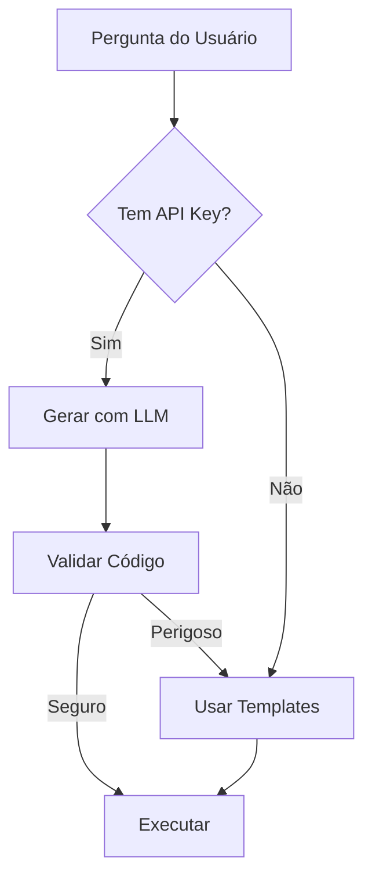

# Geração de Código Python com LLM

## Visão Geral

O sistema agora gera código Python dinamicamente usando LLM (GPT-4 ou superior) com validação de segurança.

## Como Funciona

### 1. Fluxo de Geração



### 2. Geração via LLM

```python
def generate_eda_code_with_llm(question, table_info, llm=None):
    prompt = f"""
    Gere código Python para: {question}
    Tabelas: {table_info}
    
    Requisitos:
    - Use pandas, numpy, matplotlib, seaborn
    - Adicione resultados em 'execution_results'
    - Adicione insights em 'insights'
    - Adicione gráficos em 'plots'
    """
    
    response = llm.complete(prompt)
    code = response.text
    
    # Validar segurança
    is_safe, error = validate_generated_code(code)
    if not is_safe:
        return fallback_code
    
    return code
```

### 3. Validação de Segurança

O validador verifica:

#### Padrões Perigosos Bloqueados:
- `exec`, `eval`, `__import__`
- `open`, `file`, `os.system`
- `subprocess`, `socket`, `urllib`
- `__builtins__`, `globals()`, `locals()`
- Acesso a atributos internos

#### Validações:
1. **Sintaxe**: Compila o código para verificar erros
2. **Imports**: Apenas bibliotecas permitidas
3. **Variáveis**: Usa apenas variáveis esperadas

### 4. Exemplo de Código Gerado

**Pergunta**: "Quais são as medidas de tendência central da coluna Amount?"

**Código Gerado pelo LLM**:
```python
# Calcular medidas de tendência central
amount_data = df['Amount'].dropna()

stats = {
    'Média': amount_data.mean(),
    'Mediana': amount_data.median(),
    'Moda': amount_data.mode().iloc[0] if not amount_data.mode().empty else None,
    'Desvio Padrão': amount_data.std(),
    'Variância': amount_data.var(),
    'Mínimo': amount_data.min(),
    'Máximo': amount_data.max(),
    'Quartis': {
        'Q1': amount_data.quantile(0.25),
        'Q2': amount_data.quantile(0.50),
        'Q3': amount_data.quantile(0.75)
    }
}

# Adicionar resultado
execution_results.append({
    'title': 'Medidas de Tendência Central - Amount',
    'data': pd.DataFrame([stats])
})

# Insights
insights.append(f"Média: {stats['Média']:.2f}")
insights.append(f"Mediana: {stats['Mediana']:.2f}")

# Visualização
fig, (ax1, ax2) = plt.subplots(1, 2, figsize=(12, 5))

# Histograma
ax1.hist(amount_data, bins=50, edgecolor='black')
ax1.axvline(stats['Média'], color='red', linestyle='--', label='Média')
ax1.axvline(stats['Mediana'], color='green', linestyle='--', label='Mediana')
ax1.set_xlabel('Amount')
ax1.set_ylabel('Frequência')
ax1.legend()

# Boxplot
ax2.boxplot(amount_data)
ax2.set_ylabel('Amount')

plt.tight_layout()
plots.append(plt.gcf())
```

## Vantagens

1. **Flexibilidade Total**: Responde qualquer pergunta sem templates pré-definidos
2. **Código Otimizado**: LLM gera código específico para cada caso
3. **Evolução Contínua**: Melhora com novos modelos (GPT-4, GPT-4o, etc)
4. **Segurança**: Validação previne código malicioso
5. **Fallback Inteligente**: Se falhar, usa templates seguros

## Configuração

### 1. Modelo GPT
```bash
# .env
OPENAI_MODEL=gpt-4-turbo-preview  # ou gpt-4o, gpt-4-1106-preview
```

### 2. API Key
```bash
OPENAI_API_KEY=sk-...
```

## Logs do Sistema

O sistema registra:
- 🤖 Quando gera código com LLM
- ✅ Sucesso na geração
- ⚠️ Fallback para templates
- 🛡️ Validações de segurança

## Próximas Melhorias

1. **Cache de Código**: Armazenar códigos gerados para perguntas similares
2. **Fine-tuning**: Treinar modelo específico para análise de dados
3. **Multi-agente**: Um agente gera, outro valida, outro otimiza
4. **Execução Incremental**: Executar código em etapas com feedback
